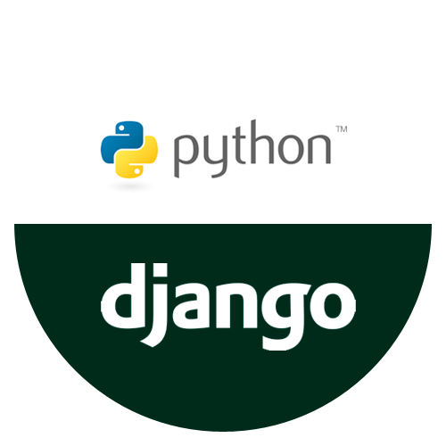

# Project Cloud Clicker

This repository is designed to demonstrate the creation of a website, hosted and deployed, using a CI/CD pipeline. 

Link to the main app on Vercel: https://cloud-clicker-react-app.vercel.app/

Link to the backend on Vercel: https://django-website-ncl5b86k3-omars-projects-d249164c.vercel.app/ (nothing to see here, mainly to use for API calls and database management, backend stuff).

# Tech Stack

The tech stack for this project consists of Vercel for the online hosting, Amazon Relational Database Service for hosting the PostgreSQL database, and Django for the back-end of the website.

# Basic Requirements

This project is designed to demonstrate the following core capabilities:

- The user is able to access a website using Python Django.
- The website has a button to click.
- The website stores and displays the number of clicks using PostgreSQL
- The website is hosted in a repository using CI/CD.
- The website is deployed using Vercel as the online host.
- The website updates upon code being pushed in the pipeline.

# Personalized Requirements

Project Cloud Clicker completes these following requirements for the personalization aspect:

- Create an authentication system where users have to login to press the button.
- Uses ReactJS for the front end.

# Design Decisions

I aimed to create a functional demonstration rather than a beautiful one. I decided the time should be spent on the functionality over aesthetics. The frontend would demonstrate a level of creativity and development knowledge, but focusing on the functionality means demonstrating the ability to build, deploy, and host a website in full, even if it looks a little ugly. That said, I went with ReactJS to at least have the basic functions down and can make simple, yet nice looking, tweaks to the page.

# Deployment Instructions

1. Make a copy of this repository. You can either fork it or copy the files into your own repo.
   1. *If you want to start fresh, follow a tutorial for starting a Django project. [Django's documentation](https://docs.djangoproject.com/en/5.0/intro/tutorial01/) is a good place to start.*
2. Clone the repo.
3. Obtain a persistent database. 
   1. *In this case, [PostgreSQL using Amazon RDS](https://aws.amazon.com/rds/postgresql/) (free tier) is a good option.*
4. Go to website/settings.py and change the details for DATABASES to match yours.
   1. *If you started fresh, you will need to add the respective HTML template and code into the project.*
   2. *Use Django's localhost test server (run 'python manage.py runserver') to make sure the website works as intended.*
   3. *Add vercel.json to your project structure.*
5. Push all changes.
6. Create an account on [Vercel](https://vercel.com/). 
7. Vercel should walk you through how to add your GitHub repo and configure the app.
8. Vercel will build and deploy the application.
   1. *NOTE: You will need to go into the settings to make it publicly available.*
9. Separate the frontend folder into a different repository. 
   1.  *The frontend repository is located here on [GitHub](https://github.com/OmarAbdelmotaleb/cloud-clicker-react-app)*
10. Use Vercel to deploy the frontend repository separately.
11. Configure the appropriate URL rewrites in vercel.json to match your backend deployment.

# Discussion

The security for this project is certainly a weakpoint to focus on beyond the current scope. Ideally, I would want to integrate Google OAuth since it has solid compatibility with Django and JavaScript. This would enable users to have a seamless and secure sign in experience. This would also enable me to utilize a better User model on the backend than a custom one I created which imposes its own security vulnerabilities. In addition, the current method of making the REST API calls to the backend is certainly not secure having it all done on vercel with the current methodology. I'd want to setup proper CSRF tokens and authentication both in the backend and the frontend to ensure the integrity of the data being called on.

Performance can be improved as well. Initially, I was not using a JavaScript framework, which inhibited some aspects in the performance of the website. I didn't like how the values were not updating dynamically since it relied on a POST request to the backend to function. I improved this by using ReactJS since it gave me a lot more freedom and versatility overall. That said, the current distance between servers is not ideal and using a free tier of AWS has its own challenges too. 

I did want to implement some additional features as well. I was thinking of putting a leaderboard on the side that would show all of the users and how many clicks they have. This would be pretty straightforward to do in ReactJS. Keeping track of how many clicks were made within the last five minutes too would be possible if I implement a logging system to keep track of time.